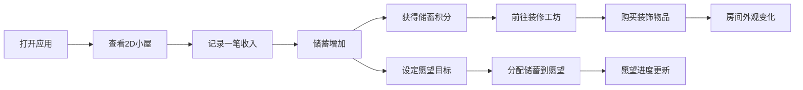

# 2D 小屋存钱页 - 产品需求文档

## 1. 产品概述

「小屋存钱」是一款可视化储蓄激励应用，通过 2D 小屋的装修变化即时反馈储蓄成果，让存钱变得有趣且有成就感。用户记录收支、设定愿望目标，并用储蓄积分兑换房间装饰，打造专属的温馨小屋。

- **核心价值**：将抽象的储蓄行为转化为可视化的房间装扮，提供即时正向反馈
- **目标用户**：想要养成储蓄习惯、喜欢治愈系养成类应用的年轻人

## 2. 核心功能

### 2.1 功能模块

1. **2D 小屋主视图**：实时展示房间状态，包含墙纸、地板、摆件等装饰元素
2. **资金簿**：记录收入和支出，支持分类管理，自动计算结余
3. **愿望清单**：设定首饰、旅行等愿望目标，分配储蓄额度，追踪进度
4. **装修工坊**：使用储蓄积分兑换墙纸、地板、摆件，即时应用到房间
5. **数据备份**：支持 JSON 格式导出导入，方便数据迁移和备份

### 2.2 页面详情

| 页面名称 | 模块名称 | 功能描述 |
|-----------|-------------|---------------------|
| 主页面 | 2D 小屋视图 | 展示房间全景，当前装饰效果，储蓄余额显示 |
| 主页面 | 底部导航 | 切换资金簿、愿望清单、装修工坊三个功能面板 |
| 资金簿面板 | 收支记录 | 添加/删除收支记录，选择分类，输入金额和备注 |
| 资金簿面板 | 分类管理 | 收入/支出分类标签，支持自定义分类 |
| 资金簿面板 | 统计概览 | 本月收入、支出、结余统计 |
| 愿望清单面板 | 愿望列表 | 展示所有愿望目标及进度条 |
| 愿望清单面板 | 新增愿望 | 添加愿望，设定目标金额和分类（首饰/旅行等） |
| 愿望清单面板 | 存入愿望 | 从储蓄中分配金额到指定愿望 |
| 装修工坊面板 | 装饰商店 | 展示可购买的墙纸、地板、摆件及价格 |
| 装修工坊面板 | 我的装饰 | 已拥有的装饰物品，可一键应用 |
| 装修工坊面板 | 积分显示 | 当前可用储蓄积分余额 |
| 设置 | 数据管理 | JSON 导出/导入备份功能 |

## 3. 核心流程

**主要用户流程**：
1. 用户打开应用，看到当前的 2D 小屋状态和储蓄余额
2. 在资金簿中记录收入/支出，储蓄随之变化
3. 储蓄增加时获得等额积分，可在装修工坊消费
4. 购买的装饰立即应用到 2D 小屋，视觉反馈即时可见
5. 用户可设定愿望目标，将储蓄分配到各个愿望
6. 支持导出 JSON 备份，保存所有数据

## 4. 用户界面设计

### 4.1 设计风格

- **整体风格**：温馨治愈系、扁平 2D 插画风格
- **主色调**：暖米色 `#FFF8F0` 为背景，柔和粉橙 `#FF9B7B` 为强调色
- **辅助色**：薄荷绿 `#A8D8B9`、淡紫 `#D4C1EC`、鹅黄 `#FFEAA7`
- **字体**：圆润可爱的无衬线字体，标题加粗，正文轻盈
- **卡片风格**：大圆角（16px）、柔和阴影、浅色背景
- **动效**：轻盈的弹性动画，按钮按压反馈，装饰物品出现时的缩放动效
- **图标风格**：线条圆润的 emoji 风格图标，增强趣味性

### 4.2 页面设计概览

| 页面名称 | 模块名称 | UI 元素 |
|-----------|-------------|-------------|
| 主页面 | 2D 小屋视图 | 居中展示的房间 SVG，墙纸/地板/摆件分层渲染，顶部余额卡片 |
| 主页面 | 底部导航 | 三个功能 Tab + 中间突出的记账按钮 |
| 资金簿面板 | 记录列表 | 时间线式记录卡片，分类标签彩色标识 |
| 愿望清单面板 | 愿望卡片 | 圆角卡片，emoji 图标，进度条动画 |
| 装修工坊面板 | 商店网格 | 等宽网格布局，物品卡片，价格标签，已拥有标识 |

### 4.3 响应式

- 桌面端：居中卡片式布局，最大宽度 480px（模拟手机端体验）
- 移动端：全屏自适应，触控友好的按钮尺寸（最小 44x44px）
- 整体采用移动端优先设计，在桌面端以"手机壳"样式展示

### 4.4 2D 小屋场景设计

- **视角**：正视图 2D 平面房间
- **布局**：墙面 + 地面 + 置物区
- **装饰层**：
  - 墙纸层：背景墙图案（纯色/条纹/波点/碎花等）
  - 地板层：地面材质（木地板/瓷砖/地毯等）
  - 摆件层：桌面/地面上的装饰品（盆栽、台灯、挂画、地毯等）
- **动画**：装饰物品购买后有缩放+弹跳的出现动画
