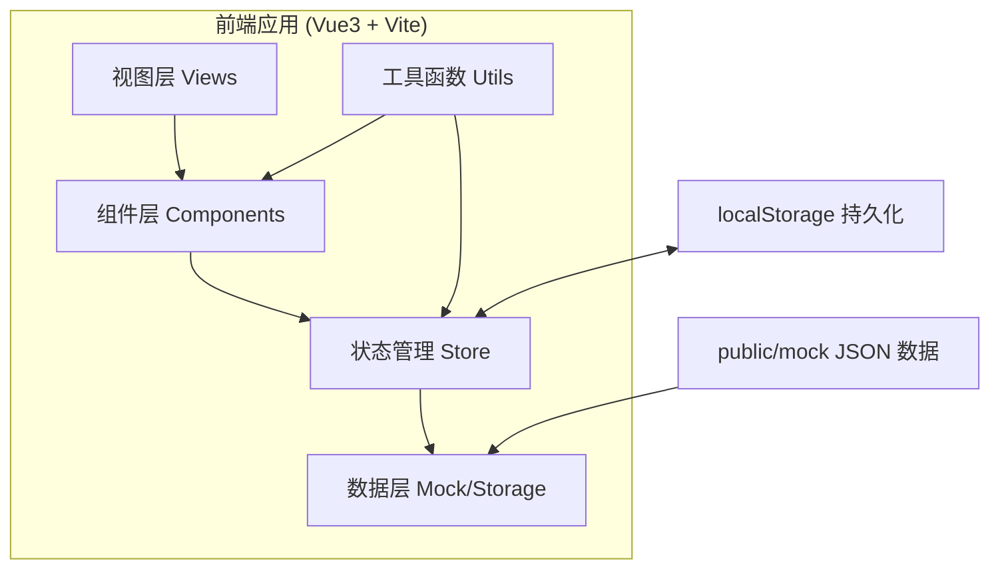
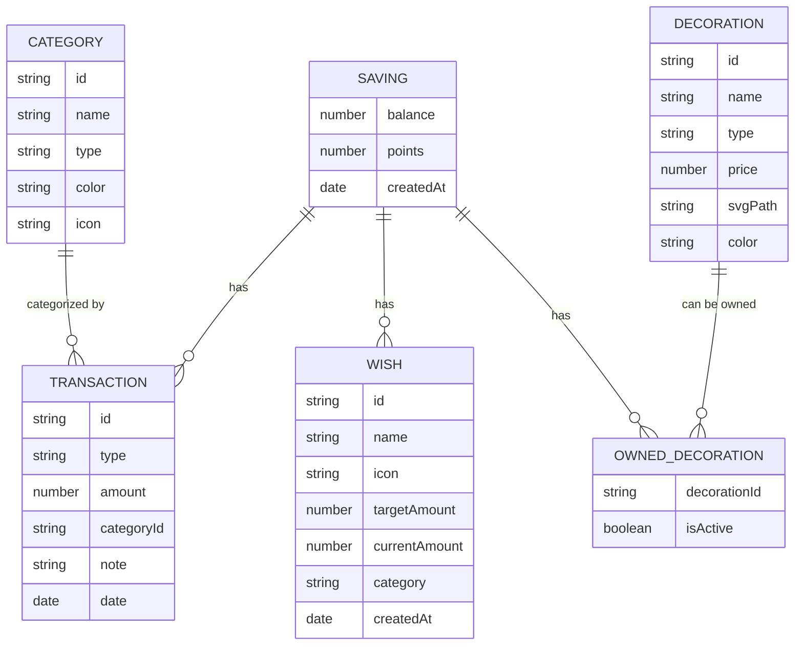

# 2D 小屋存钱页 - 技术架构文档

## 1. 架构设计



纯前端单页应用，无需后端服务。数据存储在 localStorage，首次加载从 public/mock 目录读取初始数据。支持 JSON 导出/导入实现数据备份。

## 2. 技术描述

- **前端框架**：Vue 3 + TypeScript + Composition API
- **构建工具**：Vite 5
- **样式方案**：UnoCSS（替代 Tailwind CSS，按需生成）
- **路由**：Vue Router 4
- **状态管理**：Pinia（轻量级 Vue3 状态管理）
- **图标**：Lucide Vue 图标库
- **数据持久化**：localStorage + JSON 文件导入导出
- **Mock 数据**：放置在 `public/mock/` 目录下的 JSON 文件

## 3. 目录结构

```
lyt-20/
├── public/
│   └── mock/
│       ├── initial-data.json    # 初始 mock 数据
│       ├── decorations.json     # 装饰物品数据
│       └── categories.json      # 收支分类数据
├── src/
│   ├── components/
│   │   ├── RoomView.vue         # 2D 小屋视图组件
│   │   ├── BottomNav.vue        # 底部导航
│   │   ├── TransactionList.vue  # 收支记录列表
│   │   ├── WishCard.vue         # 愿望卡片
│   │   └── ShopItem.vue         # 商店物品卡片
│   ├── views/
│   │   ├── HomeView.vue         # 主页面
│   │   ├── AccountBook.vue      # 资金簿面板
│   │   ├── WishList.vue         # 愿望清单面板
│   │   └── Workshop.vue         # 装修工坊面板
│   ├── stores/
│   │   └── saving.ts            # 储蓄数据 store
│   ├── utils/
│   │   ├── storage.ts           # localStorage 工具
│   │   └── export.ts            # JSON 导入导出工具
│   ├── types/
│   │   └── index.ts             # TypeScript 类型定义
│   ├── App.vue
│   └── main.ts
├── uno.config.ts
├── vite.config.ts
├── tsconfig.json
└── package.json
```

## 4. 数据模型

### 4.1 数据实体关系



### 4.2 数据类型定义

```typescript
// 交易类型
type TransactionType = 'income' | 'expense'

// 交易记录
interface Transaction {
  id: string
  type: TransactionType
  amount: number
  categoryId: string
  note: string
  date: string
}

// 分类
interface Category {
  id: string
  name: string
  type: TransactionType
  color: string
  icon: string
}

// 愿望
interface Wish {
  id: string
  name: string
  icon: string
  targetAmount: number
  currentAmount: number
  category: 'jewelry' | 'travel' | 'other'
  createdAt: string
}

// 装饰类型
type DecorationType = 'wallpaper' | 'floor' | 'decoration'

// 装饰物品
interface Decoration {
  id: string
  name: string
  type: DecorationType
  price: number
  style: {
    backgroundColor?: string
    backgroundImage?: string
    pattern?: string
    color?: string
  }
  position?: { x: number; y: number }
  size?: { width: number; height: number }
}

// 应用状态
interface SavingState {
  balance: number
  transactions: Transaction[]
  wishes: Wish[]
  ownedDecorations: string[]
  activeDecoration: {
    wallpaper: string
    floor: string
    decorations: string[]
  }
}
```

## 5. 状态管理设计

使用 Pinia 管理全局状态，包含：
- 储蓄余额
- 交易记录列表
- 愿望清单
- 拥有的装饰和当前应用的装饰

状态变更自动同步到 localStorage。

## 6. 关键技术点

1. **2D 小屋渲染**：使用纯 CSS + Vue 组件实现分层渲染，墙纸/地板用 background 样式，摆件用绝对定位的 SVG/元素
2. **即时反馈**：购买装饰后通过 Vue 响应式系统立即更新房间视图
3. **数据持久化**：Pinia 插件自动序列化到 localStorage
4. **JSON 导出**：Blob + URL.createObjectURL 实现文件下载
5. **JSON 导入**：FileReader API 读取并解析 JSON 文件合并到状态
6. **UnoCSS 配置**：presetUno + presetIcons + presetAttributify
